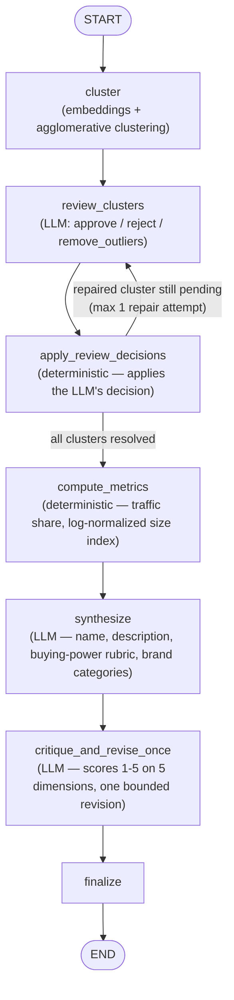

# Audience Trend Miner

An agentic pipeline that discovers emerging, commercially-viable audience segments from Wikipedia's weekly trending articles — built for the InMarket AI Builder Challenge (Option 1).

Given a week's worth of trending Wikipedia pages, the system clusters related topics, has an LLM reviewer validate and repair those clusters, computes deterministic size/traffic metrics, and synthesizes each approved cluster into a marketer-ready "audience" with a structured buying-power assessment — while explicitly filtering out non-commercial noise like breaking tragedies or one-off news spikes.

## Documentation

- [`docs/architecture.md`](docs/architecture.md) — full pipeline design, data flow, and rationale behind key decisions
- [`docs/prompt-log.md`](docs/prompt-log.md) — representative log of the Cursor-driven build process

## Project Structure

```
audience-trend-miner/
├── backend/
│   ├── app/
│   │   ├── api/            # FastAPI routes (/generate, /portfolio, /rejected, /health)
│   │   ├── services/       # Wikipedia client, article enrichment
│   │   ├── clustering/     # Embeddings, candidate clustering, deterministic metrics
│   │   ├── agent/          # LangGraph pipeline, LLM nodes, schemas
│   │   └── main.py
│   ├── tests/fixtures/     # Hand-built 12-article test dataset
│   └── sample_outputs/     # Cached article/portfolio snapshots
├── frontend/                # React + Vite + Tailwind UI
├── docker-compose.yml
├── docs/
│   ├── architecture.md
│   └── prompt-log.md
└── README.md
```

## Pipeline (LangGraph)



**Why this shape:** embeddings alone can't reliably decide whether a group of trending topics represents a coherent, commercially meaningful audience — that's a judgment call. The LLM reviewer has real authority over cluster structure (it can approve, reject, or strip a specific outlier article and request re-review), capped at one repair attempt per cluster to keep the loop bounded and the cost predictable. Deterministic code (not the LLM) computes all traffic-based metrics, since those need to be reproducible and comparable across a portfolio, not creatively generated.

## Setup

### Prerequisites
- Python 3.11+
- Node.js 18+
- An OpenAI API key (used for the reviewer, synthesizer, and critic — no Wikipedia key needed, that API is public/unauthenticated)

### Backend

```bash
cd backend
python3 -m venv .venv
source .venv/bin/activate
pip install -r requirements.txt
```

Create `backend/.env`:

```
OPENAI_API_KEY=your_key_here
```

Run it:

```bash
uvicorn app.main:app --host 127.0.0.1 --port 8000
```

Backend is now live at `http://127.0.0.1:8000` — API docs at `/docs`.

### Frontend

```bash
cd frontend
npm install
npm run dev
```

Frontend runs at `http://127.0.0.1:5173` (or whatever Vite reports) and talks to the backend automatically.

### Docker (optional, both services at once)

```bash
docker compose up --build
```

Requires `OPENAI_API_KEY` to be set in your shell environment or a root-level `.env` file, since it's passed into the backend container at runtime, never baked into the image.

## Running the Pipeline

### Via the UI
Open the frontend, pick a week-ending date and article limit, choose **Cached** (fast, reuses previously fetched Wikipedia data) or **Live** (fetches fresh from Wikipedia right now), and click **Generate portfolio**. Every request runs the real LangGraph pipeline — a repeated identical request returns instantly from a keyed cache, but any new combination of inputs triggers a full, live pipeline execution (typically 30-60 seconds).

### Via the API directly

```bash
curl -X POST http://127.0.0.1:8000/generate \
  -H "Content-Type: application/json" \
  -d '{"week_ending": "2026-07-14", "article_limit": 15, "data_mode": "cached", "force_refresh": false}'
```

### Via the fixture (offline, no API calls except LLM)

```bash
cd backend
python -m app.agent.graph --fixture
```

## Design Decisions Worth Noting

A few choices worth knowing before you dig into the code — full rationale in [`docs/architecture.md`](docs/architecture.md):

- Weekly aggregation (7 days), not a single day's top list
- Reviewer checks both coherence *and* sensitivity (tragedy/death-driven trends are rejected even when internally coherent)
- Buying power is a scored 4-factor rubric, not a bare label
- Size index is log-normalized to prevent one viral topic from dominating the portfolio
- Editorial critique is capped at one bounded revision, not open-ended

## What's Out of Scope (Deliberately)

- Cluster split/merge actions (only approve/reject/remove_outliers)
- Multi-provider LLM fallback (single provider — OpenAI gpt-4o-mini — for reliability and simplicity)
- Parallel fan-out for cluster review (sequential processing, sufficient at this scale)
- Full production-grade cache versioning (current cache key is `week_ending + article_limit + data_mode`; a production system would also key on model/prompt version)

## Tech Stack

FastAPI · LangGraph · OpenAI (gpt-4o-mini) · sentence-transformers (all-MiniLM-L6-v2) · scikit-learn (agglomerative clustering) · React · Vite · Tailwind CSS · Docker Compose